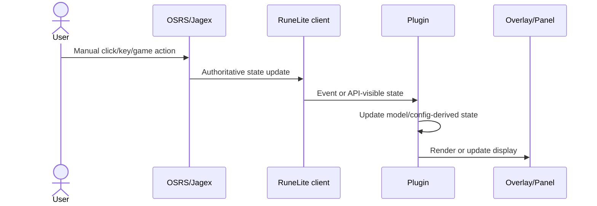

# RuneLite Plugin Testing

Use this reference when adding behavior, reviewing risk, changing Gradle/test setup, or finishing a plugin task.
Read [java-quality.md](java-quality.md) alongside this file when test quality or Java logic review is part of the task.

Sources:

- RuneLite Developer Guide: https://github.com/runelite/runelite/wiki/Developer-Guide
- RuneLite Plugin Hub README: https://github.com/runelite/plugin-hub
- RuneLite Plugin Hub build workflow: https://github.com/runelite/plugin-hub/blob/master/.github/workflows/build.yml
- RuneLite GitHub App: https://github.com/runelite/runelite-github-app
- RuneLite default Logback config: https://github.com/runelite/runelite/blob/master/runelite-client/src/main/resources/logback.xml
- RuneLite debug flag handling: https://github.com/runelite/runelite/blob/master/runelite-client/src/main/java/net/runelite/client/RuneLite.java
- RuneLite example-plugin AGENTS.md: https://github.com/runelite/example-plugin/blob/master/AGENTS.md
- RuneLite Rejected or Rolled Back Features: https://github.com/runelite/runelite/wiki/Rejected-or-Rolled-Back-Features
- Jagex Third-Party Client Guidelines: https://secure.runescape.com/m=news/third-party-client-guidelines?oldschool=1
- RuneLite wiki "Using Jagex Accounts": https://github.com/runelite/runelite/wiki/Using-Jagex-Accounts

## Automated Tests

- Use `./gradlew test` as the default automated verification command unless the repo documents a different command.
- Use `./gradlew build` when compile/package integration matters.
- Use the repo's documented JDK command if Java tooling compatibility requires it.
- Keep tests Java 11 compatible.
- Follow the repo's current test framework. External plugin templates commonly use JUnit 4, Mockito, `net.runelite:client`, and `net.runelite:jshell`.

## Plugin Hub Preflight CI

When preparing a Plugin Hub submission, release, or manifest update, offer to add a repository CI workflow that approximates the upstream Plugin Hub packager check before the user opens a `runelite/plugin-hub` PR.

Use this only as a preflight. It can catch build/package failures early, but it cannot guarantee that a future Plugin Hub PR passes all checks or maintainer review.

Base the workflow on `runelite/plugin-hub/.github/workflows/build.yml`:

- use `ubuntu-24.04` for the build job when practical
- use Java 11
- fetch `https://github.com/runelite/plugin-hub-tooling/releases/download/v1/bundle.tar.zst`
- cache Gradle dependencies and `api/` using `runelite.version` plus the tooling bundle hash when the workflow owns a Plugin Hub checkout
- run `./prepare.sh` on cache miss
- run `java -XX:+UseParallelGC -cp package.jar net.runelite.pluginhub.packager.Packager`
- upload `/tmp/manifest_diff` and, for PR-like checks, `/tmp/jars` as short-retention artifacts

For a plugin repository preflight, the workflow usually needs to synthesize a temporary Plugin Hub checkout:

1. Check out the plugin repository and determine the commit SHA being tested.
2. Check out `runelite/plugin-hub` into `plugin-hub`.
3. Create or update `plugin-hub/plugins/<plugin-name>` with the target manifest fields, especially `repository=<https GitHub clone URL>` and `commit=<tested 40-character SHA>`.
4. Set `FORCE_BUILD=<plugin-name>` when invoking the packager so the preflight builds only that plugin.
5. Keep secrets optional. The upstream workflow provides `REPO_CREDS` and `REPO_ROOT`, but a public preflight should not require upload/signing secrets.

Do not blindly copy the upstream `push`/`pull_request` trigger logic into plugin repositories. The upstream workflow is designed for `runelite/plugin-hub`, where changed files under `plugins/` define the build set. A plugin repo workflow must explicitly construct that manifest context.

RuneLite GitHub App checks are separate from the packager build. The public `runelite/runelite-github-app` source labels Plugin Hub PRs, posts a sticky `<!-- rlphc -->` compare comment, tracks author/repository/warning/package/dependency changes, buckets diff size, and marks `ready to merge` after plugin-approver reviews. It listens to GitHub App events and needs the real app installation, org team access, labels, PR reviews, and sometimes `TEAM_TOKEN`. Treat this as PR triage/review automation, not as a standalone build step.

If the user asks to "recreate Plugin Hub checks":

- offer the packager preflight workflow for build/package validation
- optionally add a lightweight local/CI script that mimics the GitHub App's public PR classification: manifest diff, compare URL, author vs manifest owner/authors, repository URL change, warning change, non-plugin/package/dependency file changes, and diff-size bucket
- explain that only an actual `runelite/plugin-hub` PR can receive the official `runelite-github-app[bot]` comments, labels, and maintainer-review outcome
- avoid claiming the preflight proves the Plugin Hub PR will pass; say it proves the same packager path succeeded for the tested manifest/commit

## Test Boundaries

- Prefer domain unit tests for parsers, calculators, session models, formatters, serializers, and settlement logic.
- Use boundary unit tests for plugin event handlers with mocked RuneLite services and synthetic events.
- Use view/model tests for Swing table models and formatting without launching RuneLite.
- Mock `Client`, config interfaces, `ClientToolbar`, `OverlayManager`, panels, and other RuneLite boundaries.
- Prefer real domain objects over mocks for business state.
- Stub config values explicitly; Mockito may not call interface default methods unless configured.

## Capture And Replay Fixtures

Use capture/replay testing when plugin behavior depends on real in-game event sequences but automating gameplay would be disallowed, flaky, or too expensive.

The safe shape is:

```text
manual gameplay in a dev client
  -> passive RuneLite event listener
  -> narrow DTO / domain event fixture
  -> offline unit test replay
  -> assertions on plugin state, calculations, panel models, or overlay models
```

This complements unit testing; it does not replace it. Keep pure unit tests for calculators, parsers, formatters, and state transitions. Add replay fixtures for realistic ordering, missing data, tick timing, and multi-event interactions that are hard to invent accurately by hand.

### Capture Boundaries

- Capture only from passive RuneLite event subscribers during manual user play.
- Do not inject input, click, type, select menu entries, log in automatically, pathfind, fight, skill, or otherwise create game actions for the player.
- Do not run automated tests against a live RuneLite client, live OSRS login, or the user's live profile.
- Prefer keeping capture tools in test/dev helper code. If capture code must live temporarily in the plugin, gate it behind an explicit developer-only option, disabled by default, and remove it before Plugin Hub submission unless it is a real reviewed feature.
- Store raw captures under a plugin-owned development path, then copy reviewed fixtures into `src/test/resources`.

### What To Capture

Capture the smallest stable shape needed by the plugin logic:

- event type and tick index
- game state transitions
- item container ID, item IDs, and quantities
- widget group/child/component IDs and only the text or properties actually used
- varbit/varplayer/varclient IDs and values
- NPC, object, item, projectile, animation, and graphic IDs when needed
- world point or local point only when location is part of the behavior
- chat message type and sanitized text only for plugins whose behavior depends on chat
- config values relevant to the scenario

Avoid capturing account names, display names, private messages, friends/clan/ignore data, auth tokens, local profile paths, worlds, or other player-identifying data unless the feature genuinely requires it and the fixture is anonymized.

### Fixture Design

- Use JSON fixtures or another simple structured format that can be read from `src/test/resources`.
- Version the fixture schema with a small integer field so tests can reject stale captures clearly.
- Prefer domain event names over RuneLite class names when possible, for example `ITEM_CONTAINER_CHANGED`, `GAME_TICK`, `VAR_CHANGED`, or `CHAT_MESSAGE`.
- Keep fixtures short and scenario-focused. Split long captures into named cases such as `loot-key-opened.json`, `loot-key-empty.json`, or `logout-clears-state.json`.
- Normalize noisy values before committing fixtures: timestamps, random IDs, player names, world numbers, and unrelated widget text.

Example fixture shape:

```json
{
  "schema": 1,
  "scenario": "inventory value updates after loot key opens",
  "events": [
    { "type": "GAME_STATE", "tick": 0, "state": "LOGGED_IN" },
    {
      "type": "ITEM_CONTAINER_CHANGED",
      "tick": 1,
      "containerId": 93,
      "items": [
        { "id": 995, "quantity": 12000 },
        { "id": 561, "quantity": 44 }
      ]
    },
    { "type": "GAME_TICK", "tick": 2 }
  ]
}
```

### Replay Tests

- Replay fixtures through the same pure service or state machine used by the plugin boundary.
- Keep RuneLite event classes at the edge. Map RuneLite events to domain DTOs in production, and map fixture DTOs to the same domain DTOs in tests.
- Assert behavior after meaningful checkpoints, not every event, unless the event-by-event state is the contract.
- Test lifecycle edges with replay data: logout clears state, region changes remove stale entities, missing widgets hide overlays, config-disabled paths ignore events, and duplicate events do not double-count.
- Treat replay tests as regression tests for observed game behavior. Still use manual RuneLite smoke testing for rendering, client wiring, and real in-game feel.

## Manual Live Debugging

Use this loop for bugs that only reproduce in a live development client, unclear OSRS/RuneLite interactions, rendering issues, widget/menu behavior, and cases where the user must perform game actions manually.

Before asking the user to reproduce the issue, write a compact interaction diagram. Use ASCII by default; Mermaid is acceptable when it is clearer. The diagram must include:

- user manual inputs
- OSRS/Jagex server or game state
- RuneLite client events/API reads
- plugin event handlers or services
- plugin state/config
- overlays, panels, widgets, logs, files, or network output

Example ASCII shape:

```text
User manual action
  -> OSRS/Jagex updates game state
  -> RuneLite client receives state/event
  -> Plugin subscriber maps event to domain state
  -> Plugin service updates cached model
  -> Overlay/panel/render code displays result
```

Example Mermaid shape:



Debugging steps:

1. State the hypothesis and the expected event/state path from the diagram.
2. Launch or offer to launch the development client with the repo's run task, usually `./gradlew run`.
3. Ensure the dev-client launch has assertions enabled with VM option `-ea`, and passes program arguments `--debug --developer-mode`. For Gradle `JavaExec` run tasks, prefer encoding these in the task as `jvmArgs '-ea'` and `args '--developer-mode', '--debug'`.
4. If the RuneLite UI is scaled incorrectly, add UI scale VM options for that debug launch, for example `-Dflatlaf.uiScale=2.2 -Dsun.java2d.uiScale=2.2`. Adjust the scale value to the user's display; do not treat `2.2` as universal.
5. Prefer launching the dev client in an agent-owned interactive terminal/PTY so stdout/stderr and stdin stay attached. Keep that session open, poll it while the user reproduces the issue, and use the live console output as the primary log stream. If the session cannot receive stdin, note that limitation before launch.
6. Confirm with the user before closing or killing the development client. If the user asks the agent to close it, stop it gracefully through the attached terminal when possible; otherwise identify and terminate only the run-task/client process that was launched for this debugging session.
7. If the user already launched the client elsewhere, ask them to either rerun it from a shared terminal command or provide a live log source the agent can read, such as a tailed RuneLite log file. If neither is available, ask for a pasted log slice after reproduction.
8. Treat default RuneLite logs as useful context, not noise to discard. RuneLite's default Logback config writes the same timestamp/thread/level/logger/message pattern to stdout and `${user.home}/.runelite/logs/client.log`, with an INFO root level; the `--debug` flag raises the root logger to DEBUG. Preserve the raw stream when practical, then focus analysis and reporting on relevant logger names, event markers, and exceptions.
9. Redact or avoid repeating account/session data, profile IDs, local paths, screenshots paths, worlds, display names, and unrelated chat/private/clan content. Do not over-filter before analysis: start broad enough to include default RuneLite lifecycle, config, event-bus, widget, container, and exception logs, then narrow only after the expected event path is understood.
10. Have the user log in and perform every RuneScape action manually. Do not click, type, select menu entries, pathfind, fight, skill, use browser/computer-use tools, or inject input for them.
11. Ask for specific observations: exact steps, all related config values, screenshots if the user provides them, visible overlay/panel state, and whether the issue survives logout, world hop, region change, plugin disable/enable, and config toggles.
12. For config-sensitive behavior, write a compact config matrix before deciding that the behavior is wrong. Include every setting that can change the branch being debugged, for example `feature enabled`, `hide/show text`, `overlay mode`, `developer debug option`, and any per-account or per-profile state.
13. Ask for or collect the smallest relevant debug log slice covering the manual reproduction. Use exact markers such as plugin startup, widget load, config change, item container event, refresh start, state mutation, restore, render eligibility, and any exception.
14. Inspect the logs yourself against the interaction diagram and config matrix before accepting the manual result. Report which expected transitions are present, missing, duplicated, out of order, or carrying unexpected state.
15. Add the least invasive instrumentation needed when the existing logs cannot prove the flow. Prefer `log.debug()` at event boundaries, state transitions, and render eligibility checks. Avoid per-frame or per-tick logs unless temporarily gated by a developer-only debug flag.
16. If event ordering or live data is the unknown, add passive capture only. Capture small sanitized DTOs, not account/player-identifying data, and never trigger game actions from capture code.
17. Convert confirmed live sequences into replay fixtures or focused unit tests where practical.
18. Remove temporary instrumentation before finishing, or keep it behind an explicit developer-only option that is disabled by default and suitable for Plugin Hub review.
19. If the logs and user-observed behavior prove expected behavior rather than a bug, say so explicitly. Identify whether the remaining issue is likely config wording, UX ambiguity, stale expectations, or an untested branch.
20. Report what was proven from logs, what was only visually observed, what remains manual-only, and the exact in-game retest steps for the user.

## Avoid In Automated Tests

- Do not start RuneLite from unit tests.
- Do not log into OSRS or automate gameplay.
- Do not hit live network services.
- Do not touch the user's live RuneLite profile directory.
- Do not depend on clipboard, dialogs, screen capture, focus state, or live UI state.
- Avoid `JOptionPane` in test paths. If needed, move the decision into domain/controller code and keep dialog calls as thin UI shells.
- Avoid tests based on wall-clock timestamps, random IDs, map iteration order, or Swing selection side effects unless that ordering or behavior is explicitly part of the contract.

## Swing Tests

- Instantiate Swing table models directly where possible.
- Assert `getValueAt`, editability, mutation behavior, and formatting.
- If Swing UI mutation must be tested, run it on the EDT with `SwingUtilities.invokeAndWait`.
- Keep Swing tests headless-friendly.

## Manual RuneLite Smoke Testing

Manual validation is required for gameplay-facing behavior. Automated checks and a clean JVM start do not prove the plugin works in game.

When finishing:

- Include or update the interaction diagram if it helps the user verify the same event path used during debugging.
- Summarize the debug log evidence used to verify the manual flow, or explicitly state that no live logs were available.
- Offer to run `./gradlew run` from the plugin root to launch the development client.
- Instruct the user to follow RuneLite's "Using Jagex Accounts" instructions: https://github.com/runelite/runelite/wiki/Using-Jagex-Accounts
- Give a concrete checklist:
  - golden path for the changed behavior
  - edge cases and failure paths
  - config toggles or persistence behavior
  - startup/shutdown cleanup where relevant
- Wait for the user to confirm in-game behavior before considering gameplay-facing work fully validated.
